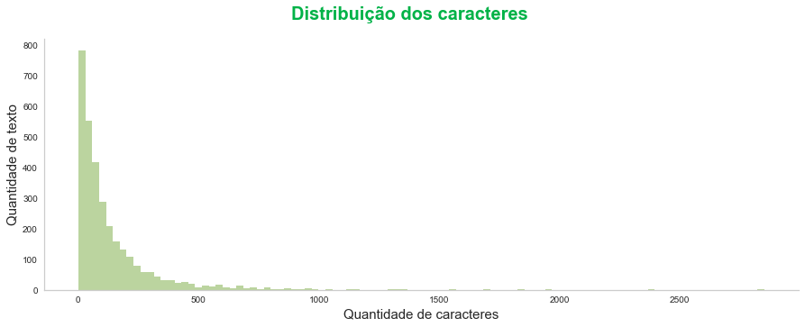

# Análise de sentimento - avaliações de produtos
Este repositório contém script para classificar os reviews positivos ou negativos dos produtos Amazon Alexa

 

# _Objetivo do projeto_

Utilizar uma base de dados para analisar os reviews dos produtos Amazon Alexa e construir um classificador de sentimentos que indique se um texto é positivo ou negativo, a fim de que as empresas possam utilizar essas informações para verificar a opinião dos clientes sobre seus produtos.

 

# _1. Problema de Negócio_

Este estudo é importante pelo fato de que praticamente todas as empresas possuem dados em redes sociais e este tipo de técnica também pode ser utilizado em textos que são postados em redes sociais e submeter o classificador para verificar se as pessoas estão falando bem ou se estão falando mal de um determinado produto.

O departamento de relações públicas precisa acompanhar e análisar os reviews das pessoas, quando publicadas nas redes sociais.

Fonte: https://www.kaggle.com/sid321axn/amazon-alexa-reviews/kernels

 

# _2. Justificativa_

- **Por quê:** O estudo é importante porque permite às empresas compreender a opinião dos clientes sobre seus produtos, a partir da análise de reviews postados em redes sociais. Isso pode ser utilizado para identificar problemas e pontos fortes dos produtos, além de orientar as decisões de desenvolvimento e marketing.
- **Como:** A partir da coleta de uma base de dados de reviews de produtos em redes sociais, serão aplicadas técnicas de análise de sentimentos para classificar cada texto em positivo ou negativo. Diferentes métodos podem ser utilizados para construir o classificador de sentimentos, tais como abordagens baseadas em regras, aprendizado supervisionado com algoritmos de classificação ou aprendizado não supervisionado com técnicas de clustering.
- **O quê:** A entrega do projeto consistirá em um relatório com a análise dos resultados e do desempenho do classificador de sentimentos, além de sugestões de ações que as empresas podem tomar para melhorar seus produtos. Além disso, pode ser entregue um software ou API para que as empresas possam utilizar o classificador em seus próprios sistemas. O resultado final será uma ferramenta capaz de fornecer informações valiosas para as empresas sobre a opinião dos clientes e permitir que elas tomem decisões informadas para melhorar seus produtos e serviços.

 

# _3. Premissas_

O conjunto de dados de amostra resume o comportamento de 3.150 clientes da Amazon.

As variáveis originais do conjuto de dados são: 

Variável | Definição
------------ | -------------
rating | nota que a pessoa deu ao produto|
date | data de quando o review foi postado no site|
variation | variação do produto, que pode indicar as cores|
verified_reviews | texto que o usuário escreveu sobre o produto|
feedback | 1 que é um texto positivo e 0 que é um texto negativo|

 

# _4. Planejamento da Solução_

1. **ENTENDIMENTO DO NEGÓCIO**

Definição do problema: É importante definir claramente qual é o problema a ser resolvido ou a pergunta a ser respondida. É preciso entender o objetivo do projeto e a relevância do problema.

2. **COLETA DOS DADOS**

Coleta de dados: Nesta etapa, os dados são coletados a partir de diversas fontes, como bases de dados, APIs, arquivos de texto, imagens, etc.

3. **LIMPEZA DOS DADOS**

Limpeza dos dados: Esta etapa consiste na descrição estatística dos dados coletados, como média, mediana, desvio padrão, entre outros. É importante entender os dados coletados, avaliar a qualidade dos dados e identificar quaisquer problemas ou limitações.

4. **ANÁLISE EXPLORATÓRIA DOS DADOS**

Análise exploratória de dados: Nesta etapa, os dados são visualizados e analisados graficamente para identificar padrões e relações entre as variáveis.

5. **PREPARAÇÃO DOS DADOS**

Preparação de dados ou Pré-processamento de dados: Nesta etapa, os dados são limpos, transformados e preparados para serem utilizados no modelo de machine learning. Isto inclui tarefas como normalização, codificação, preenchimento de valores ausentes, remoção de outliers, etc.

Divisão dos dados em conjuntos de treinamento e teste: Nesta etapa, os dados são divididos em conjuntos de treinamento e teste para avaliar o desempenho do modelo.

6. **TREINAMENTO ALGORITMOS DE MACHINE LEARNING**

Modelagem ou Seleção do modelo: Nesta etapa, um modelo de machine learning é escolhido com base na tarefa a ser realizada e nos dados disponíveis.

7. **IMPLEMENTAR O MODELO PARA A PRODUÇÃO**

Implantação: Nesta etapa, o modelo é implantado em um ambiente de produção para utilização em situações reais para resolver o problema.

8. **INSIGHTS**

Nesta etapa, são identificadas as principais descobertas e conclusões do projeto.

9. **PRÓXIMO PASSOS**

Nesta etapa, são definidos os próximos passos a serem tomados com base nos resultados obtidos e nos insights identificados. Isso pode incluir melhorias no modelo existente, coleta de mais dados, exploração de diferentes modelos, entre outros.

 

# _5. Insights_

*Resumo dos insights durante análise exploratória de dados (EDA):*

**Gráfico para visualizar a distribuição dos caracteres de cada um dos reviews.**

 

**Nota:**
- Podemos observar que a maioria dos textos tem entre 0, 100 e 200 caracteres e temos alguns outros reviews mais para direita com quase 2 mil caracteres.

**Gráfico para encontrar algum tipo de relação entre a variação do produto e a nota da pessoa.**

 

**Nota:**
- Temos 16 categorias para classificar o produto.
- Podemos obervar que o produto que tem o menor rating tem a cor branca (white), talves as pessoas acabem não gostando tanto assim da cor branca e preferem outro tipo de cor e pode ser um indicativo de que essa cor não seja tão interessante para este produto.

**Gráfico da nuvem das palavras negativas.**

 

**Nota:**
- A palavra mais falada é **'device'**, que provavelmente estão reclamando do **'dispositivo'**.

 

# _6. Modelos de Machine Learning_

_**Balanceamento dos dados:**_

 

_**Foi usado dois algoritmos para construir o modelo de classificação:**_

1. Naive Bayes.
2. Regressão Logística.

 

# _7. Performance do Modelo de Machine Learning_

Analisando este estudo de caso é **mais interessante capturar os reviews negativos**, então o modelo Naive Bayes tem um melhor desempenho, embora que a diferença seja pouca, com um f1-score de 93%.

 

Matriz de confusão - Naive Bayes

 

- Na classe 0 (texto negativo):
 - O algoritmo classificou corretamente 45 textos como negativos e 32 textos que algoritmo errou porque de fato são textos positivos.

- Na classe 1 (texto positivo):
 - O algoritmo classificou de forma errada 85 textos como negativos e 783 textos que algoritmo acertou porque de fato eles positivos.

 

# _8. Conclusão_

E o resultado desta solução, caso fosse implementada, seria proporcionar uma análise dos reviews das pessoas e classificar os textos entre positivos e negativos, desta forma a empresa pode tomar alguma atitude, entrando em contato com o cliente para ver o que exatamente aconteceu.

 

# _9. Próximos passos_

Na etapa de treinamento de algoritmos de machine learning fazer a otmização dos hiperparâmetros.
